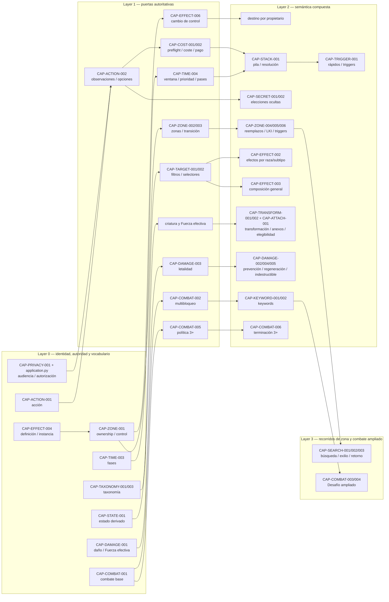

# Dependencias de capacidades del motor

## Propósito y método

Este documento deriva las 62 filas de `ENGINE_CAPABILITY_MATRIX.csv` y las contrasta **estáticamente** con las superficies solicitadas. No afirma cobertura dinámica ni eleva el estado de ninguna fila: `SUPPORTED`, `PARTIAL`, `MISSING` y `BLOCKED` conservan exactamente el sentido de la matriz. La revisión siguió, en orden: (1) modelos/enums, (2) comandos y gestores, (3) coordinador `GameEngine`, (4) codec/snapshot/replay y stores, y (5) autorización, servicio y proyección.

**Lectura de severidad.** Es la severidad de implementar la capacidad antes de sus prerrequisitos, no su prioridad de producto: **CRITICAL** puede producir estado no atómico, información privada o replay falso; **HIGH**, decisiones/legalidad incompletas; **MEDIUM**, contratos locales divergentes. `—` significa que la matriz no declara un extremo. Los nombres de fichero son relativos a `src/card_duel_engine/`.

## Registro completo de dependencias

Las columnas `prerequisites` y `dependents` de la matriz son dos vistas
recíprocas de la misma arista: si `A` figura como prerequisite de `B`, `B` debe
figurar como dependent de `A`, y viceversa. La validación documental impide IDs
huérfanos y divergencias entre ambas vistas. La única excepción a la aciclicidad
es el SCC `CAP-TIME-003` ↔ `CAP-TIME-004` ↔ `CAP-STACK-001`, explicado y
tratado como contrato integrado en la roadmap maestra; no es una licencia para
introducir otros ciclos.

| Capability | Estado | Prerequisites | Dependientes | Severidad fuera de orden | Superficies afectadas |
|---|---|---|---|---|---|
| `CAP-ACTION-001` — Modelo tipado de acciones y comandos | SUPPORTED | — | CAP-ACTION-002; CAP-TIME-003; CAP-EFFECT-001 | **MEDIUM** — contrato local incoherente o UX/replay divergente | `domain/models.py`, `engine/commands.py`, `engine/actions.py`, `engine/game.py`, `application.py`, `service.py`, `persistence/`, `storage/` |
| `CAP-ACTION-002` — Enumeración y revalidación de acciones legales | SUPPORTED | CAP-ACTION-001 | CAP-TARGET-001; CAP-SECRET-002 | **HIGH** — legalidad/resultado incorrecto que contamina capacidades posteriores | `domain/models.py`, `engine/commands.py`, `engine/actions.py`, `engine/game.py`, `application.py`, `service.py`, `persistence/`, `storage/` |
| `CAP-ACTION-003` — Transacción, rollback y determinismo | SUPPORTED | CAP-ACTION-001 | CAP-COST-002; CAP-ZONE-003; CAP-EFFECT-003 | **CRITICAL** — corrupción de estado, fuga de información o resolución no reproducible | `domain/models.py`, `engine/commands.py`, `engine/actions.py`, `engine/game.py`, `application.py`, `service.py`, `persistence/`, `storage/` |
| `CAP-COST-001` — Modelo declarativo de costes | SUPPORTED | CAP-ACTION-001 | CAP-COST-002; CAP-COST-003; CAP-COST-004 | **MEDIUM** — contrato local incoherente o UX/replay divergente | `domain/models.py`, `engine/options.py`, `engine/game.py`, `engine/stack.py`, `persistence/` |
| `CAP-COST-002` — Preflight, determinación y pago atómico | SUPPORTED | CAP-COST-001, CAP-ACTION-003 | CAP-COST-003; CAP-STACK-001 | **CRITICAL** — corrupción de estado, fuga de información o resolución no reproducible | `domain/models.py`, `engine/options.py`, `engine/game.py`, `engine/stack.py`, `persistence/` |
| `CAP-COST-003` — Costes adicionales y compuestos | SUPPORTED | CAP-COST-001, CAP-COST-002 | CAP-EFFECT-003 | **HIGH** — legalidad/resultado incorrecto que contamina capacidades posteriores | `domain/models.py`, `engine/options.py`, `engine/game.py`, `engine/stack.py`, `persistence/` |
| `CAP-COST-004` — Costes alternativos | SUPPORTED | CAP-COST-001, CAP-COST-002 | CAP-SECRET-002 | **MEDIUM** — contrato local incoherente o UX/replay divergente | `domain/models.py`, `engine/options.py`, `engine/game.py`, `engine/stack.py`, `persistence/` |
| `CAP-COST-005` — Costes dinámicos | SUPPORTED | CAP-COST-002 | CAP-COST-006; CAP-EFFECT-003 | **MEDIUM** — contrato local incoherente o UX/replay divergente | `domain/models.py`, `engine/options.py`, `engine/game.py`, `engine/stack.py`, `persistence/` |
| `CAP-COST-006` — Costes y escala X | SUPPORTED | CAP-COST-005 | CAP-EFFECT-003 | **MEDIUM** — contrato local incoherente o UX/replay divergente | `domain/models.py`, `engine/options.py`, `engine/game.py`, `engine/stack.py`, `persistence/` |
| `CAP-ZONE-001` — Ownership y control | SUPPORTED | CAP-ACTION-001 | CAP-ZONE-002; CAP-EFFECT-006 | **MEDIUM** — contrato local incoherente o UX/replay divergente | `domain/enums.py`, `domain/models.py`, `engine/zones.py`, `engine/game.py`, `engine/stack.py`, `persistence/` |
| `CAP-ZONE-002` — Zonas base y transiciones | SUPPORTED | CAP-ZONE-001, CAP-ACTION-003 | CAP-ZONE-003; CAP-SEARCH-001; CAP-ATTACH-001 | **MEDIUM** — contrato local incoherente o UX/replay divergente | `domain/enums.py`, `domain/models.py`, `engine/zones.py`, `engine/game.py`, `engine/stack.py`, `persistence/` |
| `CAP-ZONE-003` — Puerta uniforme de cambio de zona | PARTIAL | CAP-ZONE-002, CAP-ACTION-003 | CAP-ZONE-004; CAP-ZONE-005; CAP-ATTACH-001 | **CRITICAL** — corrupción de estado, fuga de información o resolución no reproducible | `domain/enums.py`, `domain/models.py`, `engine/zones.py`, `engine/game.py`, `engine/stack.py`, `persistence/` |
| `CAP-ZONE-004` — Reemplazos de transición | PARTIAL | CAP-ZONE-003, CAP-SECRET-002 | CAP-ZONE-005; CAP-TRANSMUTE-001 | **HIGH** — legalidad/resultado incorrecto que contamina capacidades posteriores | `domain/enums.py`, `domain/models.py`, `engine/zones.py`, `engine/game.py`, `engine/stack.py`, `persistence/` |
| `CAP-ZONE-005` — Triggers generales de salida | MISSING | CAP-ZONE-003, CAP-STACK-001 | CAP-EFFECT-003 | **CRITICAL** — corrupción de estado, fuga de información o resolución no reproducible | `domain/enums.py`, `domain/models.py`, `engine/zones.py`, `engine/game.py`, `engine/stack.py`, `persistence/` |
| `CAP-ZONE-006` — Last-known information | MISSING | CAP-ZONE-003, CAP-PRIVACY-001 | CAP-ZONE-005; CAP-EFFECT-003 | **CRITICAL** — corrupción de estado, fuga de información o resolución no reproducible | `domain/enums.py`, `domain/models.py`, `engine/zones.py`, `engine/game.py`, `engine/stack.py`, `persistence/` |
| `CAP-PRIVACY-001` — Proyección pública por audiencia | SUPPORTED | CAP-ZONE-002 | CAP-SECRET-001; CAP-SEARCH-001 | **CRITICAL** — corrupción de estado, fuga de información o resolución no reproducible | `domain/models.py`, `engine/game.py::observe`, `application.py`, `service.py` |
| `CAP-SECRET-001` — Mirar sin revelar | MISSING | CAP-PRIVACY-001, CAP-ZONE-002 | CAP-SECRET-002; CAP-SEARCH-002 | **HIGH** — legalidad/resultado incorrecto que contamina capacidades posteriores | `domain/models.py`, `engine/game.py::observe`, `application.py`, `service.py` |
| `CAP-SECRET-002` — Elección secreta y compuesta | PARTIAL | CAP-ACTION-002, CAP-PRIVACY-001 | CAP-SEARCH-002; CAP-ZONE-004; CAP-EFFECT-003 | **CRITICAL** — corrupción de estado, fuga de información o resolución no reproducible | `domain/models.py`, `engine/game.py::observe`, `application.py`, `service.py` |
| `CAP-TARGET-001` — Targets tipados y congelados | SUPPORTED | CAP-ACTION-002 | CAP-TARGET-002; CAP-IMMUNITY-001 | **HIGH** — legalidad/resultado incorrecto que contamina capacidades posteriores | `domain/models.py`, `engine/options.py`, `engine/game.py`, `engine/actions.py` |
| `CAP-TARGET-002` — Selectores multidimensionales | PARTIAL | CAP-TARGET-001, CAP-TAXONOMY-001 | CAP-SEARCH-001; CAP-EFFECT-002 | **HIGH** — legalidad/resultado incorrecto que contamina capacidades posteriores | `domain/models.py`, `engine/options.py`, `engine/game.py`, `engine/actions.py` |
| `CAP-TAXONOMY-001` — Dimensiones canónicas separadas | PARTIAL | — | CAP-TARGET-002; CAP-KEYWORD-001 | **HIGH** — legalidad/resultado incorrecto que contamina capacidades posteriores | `domain/enums.py`, `domain/models.py`, `engine/game.py`, `presentation.py` |
| `CAP-TAXONOMY-002` — Leyenda y tipos impresos múltiples | BLOCKED | CAP-TAXONOMY-001 | CAP-TARGET-002 | **HIGH** — legalidad/resultado incorrecto que contamina capacidades posteriores | `domain/enums.py`, `domain/models.py`, `engine/game.py`, `presentation.py` |
| `CAP-TAXONOMY-003` — Vocabulario, aliases y procedencia de subtipos | PARTIAL | CAP-TAXONOMY-001 | CAP-TARGET-002 | **MEDIUM** — contrato local incoherente o UX/replay divergente | `domain/enums.py`, `domain/models.py`, `engine/game.py`, `presentation.py` |
| `CAP-TIME-001` — Preparación inicial | PARTIAL | CAP-ZONE-002, CAP-PRIVACY-001 | CAP-TIME-002 | **MEDIUM** — contrato local incoherente o UX/replay divergente | `domain/enums.py`, `domain/models.py`, `engine/phases.py`, `engine/stack.py`, `engine/actions.py` |
| `CAP-TIME-002` — Mulligan decreciente | MISSING | CAP-TIME-001, CAP-SECRET-002 | CAP-TIME-003 | **HIGH** — legalidad/resultado incorrecto que contamina capacidades posteriores | `domain/enums.py`, `domain/models.py`, `engine/phases.py`, `engine/stack.py`, `engine/actions.py` |
| `CAP-TIME-003` — Secuencia y transición de fases | PARTIAL | CAP-ACTION-002, CAP-STACK-001 | CAP-TIME-004; CAP-COMBAT-001 | **HIGH** — legalidad/resultado incorrecto que contamina capacidades posteriores | `domain/enums.py`, `domain/models.py`, `engine/phases.py`, `engine/stack.py`, `engine/actions.py` |
| `CAP-TIME-004` — Prioridad y ventanas de respuesta | PARTIAL | CAP-TIME-003, CAP-ACTION-002 | CAP-STACK-001; CAP-COMBAT-001 | **CRITICAL** — corrupción de estado, fuga de información o resolución no reproducible | `domain/enums.py`, `domain/models.py`, `engine/phases.py`, `engine/stack.py`, `engine/actions.py` |
| `CAP-STACK-001` — Pila LIFO | SUPPORTED | CAP-ACTION-003, CAP-TIME-004 | CAP-EFFECT-001; CAP-TRIGGER-001 | **CRITICAL** — corrupción de estado, fuga de información o resolución no reproducible | `domain/enums.py`, `domain/models.py`, `engine/phases.py`, `engine/stack.py`, `engine/actions.py` |
| `CAP-TRIGGER-001` — Orden de triggers simultáneos | PARTIAL | CAP-STACK-001, CAP-SECRET-002 | CAP-ZONE-005; CAP-EFFECT-003 | **HIGH** — legalidad/resultado incorrecto que contamina capacidades posteriores | `domain/enums.py`, `domain/models.py`, `engine/phases.py`, `engine/stack.py`, `engine/actions.py` |
| `CAP-STATE-001` — Estado derivado y recálculo | SUPPORTED | CAP-ACTION-001 | CAP-DAMAGE-001; CAP-COMBAT-001; CAP-EFFECT-002 | **MEDIUM** — contrato local incoherente o UX/replay divergente | `domain/models.py`, `engine/game.py`, `engine/effects.py`, `engine/zones.py` |
| `CAP-STATE-002` — Duraciones y limpieza | SUPPORTED | CAP-STATE-001, CAP-ZONE-002 | CAP-EFFECT-002; CAP-TRANSFORM-001 | **MEDIUM** — contrato local incoherente o UX/replay divergente | `domain/models.py`, `engine/game.py`, `engine/effects.py`, `engine/zones.py` |
| `CAP-DAMAGE-001` — Daño y Heridas separados | SUPPORTED | CAP-STATE-001 | CAP-DAMAGE-002; CAP-COMBAT-001 | **HIGH** — legalidad/resultado incorrecto que contamina capacidades posteriores | `domain/models.py`, `engine/game.py`, `engine/effects.py`, `engine/combat.py`, `engine/zones.py` |
| `CAP-DAMAGE-002` — Prevención tipada por causa y duración | PARTIAL | CAP-DAMAGE-001, CAP-STATE-002 | CAP-COMBAT-001 | **HIGH** — legalidad/resultado incorrecto que contamina capacidades posteriores | `domain/models.py`, `engine/game.py`, `engine/effects.py`, `engine/combat.py`, `engine/zones.py` |
| `CAP-DAMAGE-003` — Destrucción | SUPPORTED | CAP-DAMAGE-001, CAP-ZONE-002 | CAP-DAMAGE-004; CAP-DAMAGE-005 | **MEDIUM** — contrato local incoherente o UX/replay divergente | `domain/models.py`, `engine/game.py`, `engine/effects.py`, `engine/combat.py`, `engine/zones.py` |
| `CAP-DAMAGE-004` — Regeneración | SUPPORTED | CAP-DAMAGE-003 | CAP-COMBAT-001 | **MEDIUM** — contrato local incoherente o UX/replay divergente | `domain/models.py`, `engine/game.py`, `engine/effects.py`, `engine/combat.py`, `engine/zones.py` |
| `CAP-DAMAGE-005` — Indestructibilidad | SUPPORTED | CAP-DAMAGE-003, CAP-STATE-001 | CAP-IMMUNITY-001 | **MEDIUM** — contrato local incoherente o UX/replay divergente | `domain/models.py`, `engine/game.py`, `engine/effects.py`, `engine/combat.py`, `engine/zones.py` |
| `CAP-ATTACH-001` — Anexos y Equipo | SUPPORTED | CAP-ZONE-002, CAP-COST-002 | CAP-EFFECT-002 | **MEDIUM** — contrato local incoherente o UX/replay divergente | `domain/models.py`, `engine/commands.py`, `engine/game.py` |
| `CAP-TRANSFORM-001` — Convertirse en criatura | SUPPORTED | CAP-STATE-001, CAP-STATE-002 | CAP-COMBAT-002 | **MEDIUM** — contrato local incoherente o UX/replay divergente | `domain/models.py`, `engine/effects.py`, `engine/game.py`, `persistence/` |
| `CAP-TRANSFORM-002` — Copiar/transformar definición y modificar texto | SUPPORTED | CAP-STATE-002, CAP-TARGET-001 | CAP-EFFECT-003 | **MEDIUM** — contrato local incoherente o UX/replay divergente | `domain/models.py`, `engine/effects.py`, `engine/game.py`, `persistence/` |
| `CAP-SEARCH-001` — Búsqueda filtrada en zona | PARTIAL | CAP-ZONE-002, CAP-TARGET-002, CAP-PRIVACY-001 | CAP-SEARCH-002 | **HIGH** — legalidad/resultado incorrecto que contamina capacidades posteriores | `domain/models.py`, `engine/effects.py`, `engine/stack.py`, `engine/zones.py`, `persistence/` |
| `CAP-SEARCH-002` — Revelar hasta coincidencia | SUPPORTED | CAP-SEARCH-001, CAP-ACTION-003 | CAP-EFFECT-003 | **MEDIUM** — contrato local incoherente o UX/replay divergente | `domain/models.py`, `engine/effects.py`, `engine/stack.py`, `engine/zones.py`, `persistence/` |
| `CAP-SEARCH-003` — Top-N, fondo y reordenación | MISSING | CAP-SECRET-001, CAP-SECRET-002, CAP-ZONE-003 | CAP-EFFECT-003 | **HIGH** — legalidad/resultado incorrecto que contamina capacidades posteriores | `domain/models.py`, `engine/effects.py`, `engine/stack.py`, `engine/zones.py`, `persistence/` |
| `CAP-TRANSMUTE-001` — Operación atómica de Transmutación | SUPPORTED | CAP-ZONE-004, CAP-ACTION-003 | CAP-TRANSMUTE-002 | **HIGH** — legalidad/resultado incorrecto que contamina capacidades posteriores | `domain/models.py`, `engine/commands.py`, `engine/game.py`, `engine/zones.py`, `engine/phases.py` |
| `CAP-TRANSMUTE-002` — Ventanas por tipo de Transmutación | BLOCKED | CAP-TRANSMUTE-001, CAP-TIME-004 | — | **HIGH** — legalidad/resultado incorrecto que contamina capacidades posteriores | `domain/models.py`, `engine/commands.py`, `engine/game.py`, `engine/zones.py`, `engine/phases.py` |
| `CAP-COMBAT-001` — Combate ordinario | SUPPORTED | CAP-TIME-004, CAP-DAMAGE-001, CAP-STATE-001 | CAP-COMBAT-002; CAP-COMBAT-003 | **CRITICAL** — corrupción de estado, fuga de información o resolución no reproducible | `domain/models.py`, `engine/commands.py`, `engine/combat.py`, `engine/game.py`, `engine/actions.py` |
| `CAP-COMBAT-002` — Multibloqueo y asignación ordenada | BLOCKED | CAP-COMBAT-001, CAP-SECRET-002 | CAP-KEYWORD-001 | **CRITICAL** — corrupción de estado, fuga de información o resolución no reproducible | `domain/models.py`, `engine/commands.py`, `engine/combat.py`, `engine/game.py`, `engine/actions.py` |
| `CAP-COMBAT-003` — Desafío | SUPPORTED | CAP-COMBAT-001, CAP-TRANSFORM-001 | CAP-COMBAT-004 | **HIGH** — legalidad/resultado incorrecto que contamina capacidades posteriores | `domain/models.py`, `engine/commands.py`, `engine/combat.py`, `engine/game.py`, `engine/actions.py` |
| `CAP-COMBAT-004` — Desafío iniciado por efecto/no-Señor | MISSING | CAP-COMBAT-003, CAP-TRIGGER-001 | CAP-EFFECT-003 | **HIGH** — legalidad/resultado incorrecto que contamina capacidades posteriores | `domain/models.py`, `engine/commands.py`, `engine/combat.py`, `engine/game.py`, `engine/actions.py` |
| `CAP-COMBAT-005` — Combate multijugador | PARTIAL | CAP-COMBAT-001, CAP-PRIVACY-001 | CAP-COMBAT-006 | **HIGH** — legalidad/resultado incorrecto que contamina capacidades posteriores | `domain/models.py`, `engine/commands.py`, `engine/combat.py`, `engine/game.py`, `engine/actions.py` |
| `CAP-COMBAT-006` — Terminación multijugador | BLOCKED | CAP-COMBAT-005 | — | **CRITICAL** — corrupción de estado, fuga de información o resolución no reproducible | `domain/models.py`, `engine/commands.py`, `engine/combat.py`, `engine/game.py`, `engine/actions.py` |
| `CAP-KEYWORD-001` — Keywords nominales de combate | MISSING | CAP-TAXONOMY-001, CAP-COMBAT-001 | CAP-EFFECT-002 | **CRITICAL** — corrupción de estado, fuga de información o resolución no reproducible | `domain/enums.py`, `domain/models.py`, `engine/combat.py`, `engine/game.py`, `engine/effects.py` |
| `CAP-KEYWORD-002` — Keywords concedidas y retiradas | PARTIAL | CAP-KEYWORD-001, CAP-STATE-002 | CAP-IMMUNITY-001 | **HIGH** — legalidad/resultado incorrecto que contamina capacidades posteriores | `domain/enums.py`, `domain/models.py`, `engine/combat.py`, `engine/game.py`, `engine/effects.py` |
| `CAP-IMMUNITY-001` — Inmunidades tipadas | PARTIAL | CAP-TARGET-001, CAP-TAXONOMY-001, CAP-STACK-001 | CAP-EFFECT-001 | **CRITICAL** — corrupción de estado, fuga de información o resolución no reproducible | `domain/enums.py`, `domain/models.py`, `engine/game.py`, `engine/stack.py` |
| `CAP-EFFECT-001` — Primitivas declarativas de efecto | PARTIAL | CAP-ACTION-001, CAP-STACK-001, CAP-TARGET-001 | CAP-EFFECT-002; CAP-EFFECT-003 | **CRITICAL** — corrupción de estado, fuga de información o resolución no reproducible | `domain/enums.py`, `domain/models.py`, `engine/effects.py`, `engine/stack.py`, `engine/game.py` |
| `CAP-EFFECT-002` — Efectos continuos y estado derivado | PARTIAL | CAP-STATE-001, CAP-STATE-002, CAP-TARGET-002 | CAP-EFFECT-003 | **HIGH** — legalidad/resultado incorrecto que contamina capacidades posteriores | `domain/enums.py`, `domain/models.py`, `engine/effects.py`, `engine/stack.py`, `engine/game.py` |
| `CAP-EFFECT-003` — Composición de efectos | MISSING | CAP-EFFECT-001, CAP-SECRET-002, CAP-ZONE-003, CAP-COST-003 | CAP-CATALOG-001 | **CRITICAL** — corrupción de estado, fuga de información o resolución no reproducible | `domain/enums.py`, `domain/models.py`, `engine/effects.py`, `engine/stack.py`, `engine/game.py` |
| `CAP-EFFECT-004` — Creación de fichas/instancias | PARTIAL | CAP-EFFECT-003, CAP-ZONE-003 | CAP-CATALOG-001 | **HIGH** — legalidad/resultado incorrecto que contamina capacidades posteriores | `domain/enums.py`, `domain/models.py`, `engine/effects.py`, `engine/stack.py`, `engine/game.py` |
| `CAP-EFFECT-005` — Descarte forzado con elector | MISSING | CAP-SECRET-002, CAP-ZONE-003 | CAP-EFFECT-003 | **HIGH** — legalidad/resultado incorrecto que contamina capacidades posteriores | `domain/enums.py`, `domain/models.py`, `engine/effects.py`, `engine/stack.py`, `engine/game.py` |
| `CAP-EFFECT-006` — Cambio de ownership/control | SUPPORTED | CAP-ZONE-001, CAP-STATE-002 | CAP-EFFECT-003 | **MEDIUM** — contrato local incoherente o UX/replay divergente | `domain/enums.py`, `domain/models.py`, `engine/effects.py`, `engine/stack.py`, `engine/game.py` |
| `CAP-CATALOG-001` — Ingesta completa del corpus | PARTIAL | CAP-EFFECT-003, CAP-TAXONOMY-001 | — | **CRITICAL** — corrupción de estado, fuga de información o resolución no reproducible | `domain/models.py`, `engine/game.py`, `presentation.py`, `persistence/codec.py` |
| `CAP-NORM-001` — Resolución de ambigüedades editoriales | BLOCKED | — | CAP-TIME-003; CAP-TIME-004; CAP-COMBAT-002; CAP-COMBAT-006; CAP-TRANSMUTE-002 | **CRITICAL** — corrupción de estado, fuga de información o resolución no reproducible | Documentación normativa; guardas en `engine/phases.py`, `engine/combat.py`, `engine/game.py` |
| `CAP-NORM-002` — Presupuesto de puntos Mítico | BLOCKED | — | CAP-CATALOG-001 | **HIGH** — legalidad/resultado incorrecto que contamina capacidades posteriores | Documentación normativa; guardas en `engine/phases.py`, `engine/combat.py`, `engine/game.py` |

## Cadenas críticas y orden por layers

Las flechas significan «debe estabilizarse antes que». El grafo es deliberadamente acíclico: una capacidad aparece una sola vez y las dependencias cruzadas que crearían ciclos se expresan en la tabla, no como una segunda dirección. “Destino por propietario” es el tramo contractual de `CAP-ZONE-001/003`, no una capacidad inventada. “Recursos Rápidos” queda representado por legalidad de acciones y ventanas; las keywords por `CAP-KEYWORD-001/002`.

### Consecuencias concretas de romper el orden

* **Instancia/ownership.** Crear o copiar sin separar `definition_id`, `owner_id` y `controller_id` hace imposible restaurar control o enviar descarte/exilio al propietario correcto.
* **Zonas.** Implementar búsqueda/retorno antes de una transición causal uniforme omite reemplazos, LKI, triggers, limpieza y audiencia en rutas directas.
* **Secretos.** Crear elecciones antes de autorización y proyección revela candidatos, orden o la opción elegida a observadores no autorizados.
* **Acción/coste/pila.** Pagar antes de congelar y validar el coste permite pagos parciales; apilar antes del pago permite responder a una acción que nunca fue legal.
* **Timing.** Añadir Recursos Rápidos o triggers sin política de prioridad/pases deja indeterminado cuándo entran y quién responde.
* **Taxonomía/selectores/composición.** Codificar efectos de raza por nombre o por identidad evita el vocabulario canónico y no compone con continuos.
* **Estado/daño/combate.** Persistir Fuerza “efectiva” como otra verdad vuelve obsoletas letalidad, anexos, transformaciones y elegibilidad; keywords sobre un reparto multibloqueo indefinido amplifican esa divergencia.
* **Multijugador.** Resolver eliminación de un jugador antes de una política 3+ puede dejar ownership, turn order, pila y ganador sin definición.

## Contratos parciales: reutilización exacta y tramo ausente

| Capability parcial | Contrato existente reutilizable | Tramo exacto que falta |
|---|---|---|
| `CAP-ZONE-003` | `ZoneManager._move_card` centraliza muchos movimientos, aplica reemplazos y actualiza listas/instancia; `MoveReason` conserva parte de la causa. | Todas las rutas deben cruzar una sola puerta y emitir un registro causal común con origen, destino final, lote, audiencia y estado anterior; hoy los eventos son heterogéneos y no constituyen LKI. |
| `CAP-ZONE-004` | `MoveReplacementDefinition`, `PendingMoveReplacement`, `replacement_order`, `SetReplacementOrder` y `ResolveMoveReplacement` ofrecen orden previo o elección diferida. | Predicado general origen/destino/objeto, composición de reemplazos de múltiples fuentes y aplicación transaccional sobre cualquier transición. |
| `CAP-SECRET-002` | `PendingSearch`, `PendingMoveReplacement`, comandos de orden/targets y option tokens opacos de `AuthenticatedMatchApplication`. | Un `PendingChoice` único con elector, audiencia, candidatos, cardinalidad, modo y orden para elecciones arbitrarias/compuestas. |
| `CAP-TARGET-002` | `CardFilter.matches` filtra `kinds`, `ranks`, intersección de `subtypes` y `definition_ids`; `TargetMode`, `ZoneTarget` y `TargetAllocation` tipan selección básica. | Dominio, keyword, controlador, zona, visibilidad, subtipo exacto y composición AND/OR explícita. |
| `CAP-TAXONOMY-001` | `CardKind`, `CardRank`, `LordDomain`, `CardDefinition.subtypes` y `card_id` mantienen dimensiones separadas en parte. | Tipos impresos múltiples/Leyenda autónoma, dominio general (no sólo Señor) y subtipo con procedencia canónica. |
| `CAP-TAXONOMY-003` | `CardDefinition.subtypes` y parches/efectos continuos conservan cadenas de subtipo. | Registro canónico versionado con grafía, alias autorizado y procedencia; no fusionar aliases por heurística. |
| `CAP-TIME-001` | `new_match`, `start_match`, barajado RNG y `observe` preparan mazos/manos privadas; `mulligan` existe como método. | Elección persistible/autorizada de quién empieza y regla normativa de prioridad inicial; integrar preparación completa al comando/replay público. |
| `CAP-TIME-003` | `Phase`, `PhaseManager`, `_phase_sequence`, `_enter_phase_or_skip` y supresiones modelan la secuencia y guardas. | Canon de posición/ventanas exactas, consecuencias completas de omisión y cierre de extremos marcados `blocked_by_normative`. |
| `CAP-TIME-004` | `priority_player_id`, `consecutive_passes`, `phase_priority_complete`, `PassPriority` y `StackManager._pass_priority` rotan prioridad y resuelven LIFO. | Canon de primera prioridad, cantidad de pases y alcance de «cualquier momento»/Recurso Rápido por fase y rol. |
| `CAP-TRIGGER-001` | `OrderTriggeredAbilities`, `ChooseTriggeredTargets`, `pending_trigger_batch` y `_queue_trigger_batch` persisten parte del orden y targets. | Recolección general de triggers simultáneos (incluidos cambios de zona), política completa entre controladores y primera prioridad normativa. |
| `CAP-DAMAGE-002` | `damage_prevention` y `wound_prevention` son reservas consumibles; `PREVENT_DAMAGE/PREVENT_WOUNDS` las cargan. | Prevención ilimitada o filtrada por combate, fuente, causa y duración, con procedencia y expiración tipadas. |
| `CAP-SEARCH-001` | `SEARCH_ZONE`, `CardFilter`, `PendingSearch`, `ResolveSearchChoice`, pausa/reanudación de pila y barajado cubren una ruta persistible. | Generalizar audiencia, propietario/controlador, orden/top-N, revelación mínima y combinaciones de destino/filtro sin filtrar candidatos. |
| `CAP-COMBAT-005` | `defending_player_id`, selección explícita del defensor y `turn_order` aceptan más de dos participantes. | Política normativa de eliminación/continuidad, reasignación de objetos/turno, empate y ganador tras salir un participante. |
| `CAP-KEYWORD-002` | `_effective_keywords` compone definición efectiva, Equipo, continuos y `TextPatchDefinition`, respetando retiros. | Semántica tipada de las keywords nominales (`CAP-KEYWORD-001`), conflictos/layers y procedencia expuesta; componer cadenas no implementa conducta. |
| `CAP-IMMUNITY-001` | `_card_can_be_targeted` revalida targets y reconoce la inmunidad Divina específica a fuentes de Evento/Recurso Rápido mediante `AbilitySourceProfile`. | Predicado general por tipo/naturaleza de fuente, habilidad, permanencia, controlador y clase de efecto, incluida la ambigüedad normativa indicada. |
| `CAP-EFFECT-001` | `EffectKind`/`EffectDefinition` y `EffectResolver` despachan primitivas tipadas existentes; stack congela fuente/targets/X. | Primitivas ausentes y contrato extensible que cubra semántica completa sin handlers por identidad ni suponga que representable equivale a incorporado. |
| `CAP-EFFECT-002` | `ContinuousEffectDefinition`, `_continuous_effects_for`, `_current_strength`, `_effective_keywords`, supresión de fase y limpieza recalculan varios deltas. | Layers/precedencia general, selectores completos, procedencia/exclusiones y toda combinación de continuo dependiente de taxonomía. |
| `CAP-EFFECT-004` | `GameEngine._create_candidate_instance` construye `CardInstance` desde catálogo con owner/controller; `new_match` lo usa para cartas de mazo. | Primitiva de efecto para crear fichas/instancias durante resolución, definición de ficha y transición/evento atómicos. |
| `CAP-CATALOG-001` | Catálogo mecánico, validación de definiciones, snapshot de catálogo y `CardPresentationCatalog` separan mecánica/presentación. | Ingestar sólo semántica y procedencia completas para las 431 entradas; siguen 2 SUPPORTED, 245 PARTIAL, 143 MISSING y 41 AMBIGUOUS según la matriz. |

Las capacidades `MISSING` no tienen contrato parcial que pueda confundirse con soporte: pueden existir piezas vecinas (por ejemplo eventos `ON_TRANSMUTED`), pero no el contrato indicado. Las `BLOCKED` requieren primero autoridad normativa; implementar una interpretación local no cambia su estado.

## Deuda arquitectónica: identidad, sin precedente mecánico

`CardFilter.definition_ids` **no es precedente para comportamiento específico por identidad**. Su uso actual es un predicado de selección dentro de `CardFilter.matches`; debe tratarse como deuda porque facilita expresar excepciones por `card_id` donde corresponde taxonomía, selector o composición declarativa. No se debe ampliar para despachar efectos, legalidad, triggers o reglas de cartas concretas.

Sí son usos legítimos y separados de identidad:

1. **Catálogo:** clave estable de `CardDefinition` y referencia `CardInstance.definition_id`/override para localizar datos mecánicos.
2. **Persistencia/replay:** referencias estables serializables, snapshot de catálogo y validación determinista.
3. **Límites de copias/construcción:** agrupar copias de la misma definición al validar un mazo.
4. **Presentación:** enlazar la ficha visual con la definición, sin introducir semántica mecánica.

Criterio de salida de la deuda: retirar `definition_ids` del selector mecánico general (o aislarlo tras un caso normativo explícito), migrar cartas a dimensiones canónicas y añadir una prueba que rechace dispatch/handlers por `card_id`, conservando los cuatro usos legítimos anteriores.

## Límites del contraste

* Es un contraste estático de las rutas solicitadas, no una afirmación de que todo el corpus tenga pruebas end-to-end.
* `persistence/` y `storage/` prueban representabilidad, checksums, replay y CAS; no completan semántica ausente.
* `application.py` autoriza identidad externa y opacifica opciones; `service.py` proyecta una observación del jugador; ninguna sustituye una elección secreta tipada dentro del dominio.
* `presentation.py` valida metadatos visuales por `card_id`; no debe convertirse en fuente de taxonomía o reglas.
