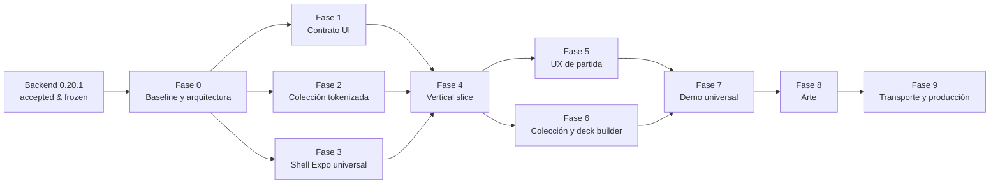

# Roadmap rector de FrontEnd y contenido

## 1. Decisión de producto

> **BACKEND BASELINE ACCEPTED — card-duel-engine 0.20.1**

Esta aceptación es literal y constituye la línea base de la siguiente etapa. El
equipo deja de **desarrollar el motor** como objetivo abierto y pasa a
**construir el producto sobre un motor estable**.

`card-duel-engine 0.20.1` queda congelado. Sólo se reabrirá trabajo en el motor
cuando exista evidencia de al menos una de estas condiciones:

1. una carta real descubre una capacidad general ausente;
2. existe un defecto reproducible;
3. existe una inconsistencia entre la legalidad declarada y la ejecución;
4. existe un problema de seguridad, persistencia o replay.

Una reapertura debe resolver la capacidad general o el defecto demostrado, con
pruebas de regresión, sin convertirse en una ampliación especulativa. Quedan
prohibidas las mecánicas especulativas y cualquier lógica específica por
`card_id`, en el motor y en las demás capas.

Este documento define dirección, fronteras y criterios de salida. No autoriza
ni implementa ninguna fase futura.

## 2. Baseline de FrontEnd y plataformas

El baseline tecnológico del FrontEnd es:

- React Native;
- Expo;
- TypeScript;
- Expo Router;
- soporte Web desde el inicio.

Las plataformas objetivo son **Android, iOS y Web**. La paridad funcional entre
ellas se considera una restricción de producto desde el primer vertical slice,
no una adaptación posterior. **Expo todavía no se inicializa**: la creación del
workspace, la selección de versiones y cualquier configuración pertenecen a la
Fase 3 y requieren una decisión explícita para comenzar.

La dirección de integración obligatoria es:

```text
GameEngine → Application / MatchService → UI Integration Contract → React Native / Expo
```

El FrontEnd nunca integra directamente con `GameEngine`. La capa de aplicación
orquesta casos de uso y el contrato de integración publica únicamente datos y
operaciones aptos para el cliente.

## 3. Fronteras de responsabilidad

### 3.1 Engine

Es la autoridad de reglas y transición del estado. Valida comandos, determina
legalidad, calcula y aplica efectos, conserva invariantes y produce el resultado
autoritativo reproducible. Su baseline es 0.20.1 y se rige por la política de
congelación anterior.

### 3.2 Content

Describe las cartas y colecciones reales mediante datos declarativos. Conecta la
identidad mecánica con el material visible al jugador, pero no ejecuta reglas ni
introduce excepciones por carta. La incorporación de contenido puede revelar una
capacidad general ausente; no justifica esconder comportamiento ejecutable en
catálogos, textos, arte o adaptadores.

### 3.3 Presentation

Proyecta el dominio a modelos legibles por jugadores: nombres, texto de reglas,
arte, etiquetas y estados de visualización. Oculta información privada según el
punto de vista y no altera la semántica mecánica.

### 3.4 UI

Renderiza las proyecciones recibidas, recoge intención humana y presenta
resultados, errores y estados de espera. Puede gestionar estado visual efímero,
accesibilidad y navegación, pero no estado autoritativo de partida.

### 3.5 Transport

Traslada solicitudes y respuestas entre cliente y servidor, preservando
identidad de partida, versión, orden, autenticación y errores. No interpreta ni
duplica las reglas. El transporte remoto es eventual: el contrato debe poder
probarse primero con un adaptador local sin confundir ese adaptador con el
backend.

### 3.6 Autoridad y prohibiciones del cliente

El backend es autoritativo. En particular, la UI **no**:

- decide legalidad;
- ejecuta reglas;
- calcula efectos autoritativos;
- modifica `GameState`;
- fabrica comandos internos;
- accede a información privada del rival.

La UI sólo elige entre opciones públicas emitidas por el servidor y devuelve la
referencia pública acordada. Una animación, predicción o validación de formulario
nunca sustituye la resolución del backend.

## 4. Contrato UI y deuda conocida de acciones legales

### 4.1 Deuda actual

`PublicLegalAction.action` sólo discrimina el tipo general de acción y no
identifica necesariamente una alternativa concreta. Por ello no es suficiente,
por sí solo, para que una interfaz seleccione sin ambigüedad entre combinaciones
de carta, objetivo, modo, valor u otras opciones legales del mismo tipo.

No se debe compensar esta deuda reconstruyendo comandos en el cliente, leyendo
estado privado ni duplicando enumeración de reglas.

### 4.2 Decisión reservada para la Fase 1

La Fase 1 definirá **IDs opacos de alternativas**, ligados a la versión CAS del
estado que originó la lista y resueltos exclusivamente por el servidor. El
cliente enviará el ID seleccionado y la versión CAS correspondiente; el servidor
comprobará vigencia, resolverá la alternativa a su comando interno y volverá a
validarla antes de ejecutarla.

El formato, longitud, codificación, duración y estructura interna de esos IDs no
se fijan todavía. No son comandos serializados, no conceden autoridad y no deben
permitir inferir información privada. Un ID obsoleto o perteneciente a otra
partida, actor o versión CAS debe ser rechazado de forma explícita.

## 5. Modelo de contenido y presentación

`CardDefinition` permanece como **verdad mecánica**: es la definición declarativa
que consume el motor. Este roadmap no propone cambios en `CardDefinition` ni
añade contenido ejecutable.

Conceptualmente, `CardPresentation` es la representación de una carta destinada
al jugador y contiene:

| Campo | Propósito |
| --- | --- |
| `card_id` | Une la presentación con la identidad mecánica, sin condicionar lógica. |
| `token` | Identificador editorial estable dentro de la colección tokenizada. |
| `name` | Nombre mostrado al jugador. |
| `rules_text` | Explicación humana de las reglas ya expresadas mecánicamente. |
| `art` | Referencia al recurso visual y sus variantes, no al comportamiento. |

`CardPresentation` es una proyección no autoritativa. `rules_text` explica, pero
no se evalúa; `art` representa, pero no codifica; `token` organiza contenido,
pero no decide reglas. La asociación con `CardDefinition` debe validarse para
detectar identidades huérfanas, duplicadas o textos desalineados.

## 6. Fases 0–9

Cada fase necesita una decisión separada de inicio. Los entregables siguientes
son objetivos y criterios, no trabajo implementado por este documento.

### Fase 0 — Baseline y arquitectura

**Objetivo:** cerrar la etapa centrada en el motor y fijar fronteras de producto.

- Registrar la aceptación literal de Backend 0.20.1 y su política de congelación.
- Adoptar las capas Engine, Content, Presentation, UI y Transport.
- Fijar la cadena de integración y la autoridad del backend.
- Registrar las prohibiciones de mecánicas especulativas y lógica por `card_id`.

**Salida:** este documento aprobado como referencia rectora, sin código de fases
posteriores.

### Fase 1 — UI Integration Contract

**Objetivo:** diseñar y probar el límite estable entre `MatchService` y clientes.

- Definir snapshots públicos por punto de vista, eventos/resultados y errores.
- Definir solicitudes de intención sin exponer comandos internos.
- Introducir conceptualmente IDs opacos de alternativas ligados a versión CAS,
  con resolución exclusiva del servidor, sin fijar prematuramente su formato.
- Especificar rechazo de concurrencia obsoleta, privacidad y compatibilidad.
- Crear pruebas de contrato independientes de React Native y del transporte.

**Salida:** una UI puede observar una partida y seleccionar una alternativa
pública inequívoca sin conocer ni ejecutar reglas.

### Fase 2 — Colección tokenizada

**Objetivo:** preparar contenido real, trazable y validable.

- Inventariar la colección mediante tokens editoriales estables.
- Asociar cada presentación con un `card_id` mecánico existente.
- Definir y validar conceptualmente `CardPresentation` (`card_id`, `token`,
  `name`, `rules_text`, `art`).
- Detectar faltantes y contradicciones; elevar al motor sólo capacidades generales
  ausentes demostradas por cartas reales.
- Mantener datos, texto y recursos libres de lógica ejecutable.

**Salida:** corpus de presentación consistente y enlazable, sin modificar la
verdad mecánica de `CardDefinition`.

### Fase 3 — Shell Expo universal

**Objetivo:** inicializar, sólo al comenzar esta fase, el shell de React Native,
Expo, TypeScript y Expo Router con Web habilitada desde el primer commit.

- Establecer navegación, theming, accesibilidad, pruebas y calidad estática.
- Definir adaptadores del contrato sin importar internals del motor.
- Verificar arranque y navegación equivalentes en Android, iOS y Web.
- Evitar reglas, contenido ejecutable y dependencias directas de `GameEngine`.

**Salida:** shell vacío pero ejecutable en las tres plataformas. Al aprobar este
roadmap, Expo sigue sin inicializar.

### Fase 4 — Vertical slice jugable

**Objetivo:** hacer converger el contrato (Fase 1), el contenido (Fase 2) y el
shell (Fase 3) en un flujo mínimo de partida.

- Crear/iniciar una partida, mostrar una vista pública y sus cartas presentables.
- Mostrar alternativas legales inequívocas y enviar la selección opaca.
- Refrescar por versión CAS, presentar rechazos obsoletos y el resultado
  autoritativo.
- Cubrir al menos un recorrido real en Android, iOS y Web sin acceso rival.

**Salida:** recorrido end-to-end pequeño y demostrable; ninguna regla vive en UI.

### Fase 5 — UX de partida

**Objetivo:** convertir el vertical slice correcto en una experiencia clara.

- Diseñar jerarquía del tablero, prioridad, fases, selección y confirmación.
- Incorporar estados de carga, reconexión, error y alternativa caducada.
- Añadir feedback, animación no autoritativa, responsive design y accesibilidad.
- Realizar pruebas de usabilidad sin alterar la semántica del contrato.

**Salida:** partida comprensible y operable en las tres plataformas.

### Fase 6 — Colección y deck builder

**Objetivo:** permitir explorar contenido y construir mazos mediante operaciones
autoritativas.

- Presentar búsqueda, filtros, detalle y disponibilidad de colección.
- Crear/editar/validar mazos sin replicar reglas de legalidad en el cliente.
- Mostrar razones devueltas por el backend para restricciones e invalidez.
- Conservar tokens, `card_id` y presentaciones sin ramas de lógica por carta.

**Salida:** flujo completo colección–mazo compatible con el contrato y usable en
Android, iOS y Web.

### Fase 7 — Demo universal

**Objetivo:** hacer converger UX de partida (Fase 5) y colección/deck builder
(Fase 6) en una demostración integrada.

- Unir onboarding, selección o construcción de mazo y partida completa acotada.
- Empaquetar contenido permitido y estados de ejemplo reproducibles.
- Ejecutar matriz funcional, privacidad, accesibilidad y responsive en Android,
  iOS y Web.
- Recoger métricas y feedback sin declarar aún infraestructura de producción.

**Salida:** demo universal coherente, distribuible a evaluación y basada en el
mismo backend autoritativo.

### Fase 8 — Arte

**Objetivo:** elevar la identidad visual una vez estabilizados los flujos.

- Definir dirección de arte, licencias, procedencia y presupuesto de recursos.
- Producir y optimizar variantes por densidad y plataforma con fallbacks.
- Integrar referencias `art` de `CardPresentation` y comprobar legibilidad,
  rendimiento y accesibilidad.
- Mantener los recursos visuales completamente pasivos respecto de las reglas.

**Salida:** acabado visual consistente y auditable, sin modificar mecánicas.

### Fase 9 — Transporte y producción eventual

**Objetivo:** llevar el producto validado a operación remota y mantenible cuando
exista una decisión explícita de producción.

- Seleccionar el transporte y desplegar `Application / MatchService` sin cambiar
  el contrato semántico probado localmente.
- Incorporar autenticación, autorización, protección de datos privados,
  idempotencia, límites, observabilidad y recuperación.
- Asegurar concurrencia CAS, persistencia, migraciones, replay y compatibilidad.
- Definir CI/CD, entornos, secretos, telemetría, soporte y rollback para Android,
  iOS y Web.

**Salida:** operación productiva medible y segura; el servidor conserva toda la
autoridad.

## 7. Dependencias y secuencia



Las Fases 1–3 pueden avanzar como líneas coordinadas sólo después de la Fase 0,
pero las tres deben converger antes de declarar completa la Fase 4. Desde el
vertical slice, las Fases 5 y 6 pueden progresar en paralelo y deben converger en
la Fase 7. La secuencia continúa después con Fase 8 y Fase 9; ninguna fase puede
usar su posición futura para anticipar lógica o infraestructura en una anterior.

## 8. Reglas de gobierno de la etapa

1. Toda funcionalidad comienza con una carta real, un caso de uso de producto o
   una necesidad operativa demostrable; nunca con una mecánica hipotética.
2. Ninguna capa admite condicionales de comportamiento por `card_id`.
3. Cualquier aparente necesidad de cambiar el motor se clasifica contra las
   cuatro excepciones de congelación y se acompaña de reproducción y pruebas.
4. Las decisiones de presentación no cambian legalidad ni resultados.
5. La privacidad se aplica al construir la proyección del servidor, no ocultando
   datos ya enviados al cliente.
6. El contrato precede a la interfaz y el adaptador de transporte sucede al caso
   de uso; no se saltan capas para acelerar una demo.
7. Cada fase demuestra Android, iOS y Web cuando ya existe una aplicación
   ejecutable, y documenta explícitamente cualquier diferencia inevitable.

El criterio rector de todas las decisiones es la transición ya adoptada:
**dejamos de desarrollar el motor y empezamos a construir el producto sobre un
motor estable**.
