# Diagnóstico de `PhaseManager` 0.20.1

## 1. Propósito y veredicto provisional

Este documento reconstruye el flujo real de fases antes de extraer un posible
`PhaseManager`. Es un diagnóstico: **no propone ni realiza cambios de código**.
La frontera provisional segura contiene sólo coordinación de transición; draw,
cola legendaria, cleanup, eventos, efectos, triggers, combate y comprobaciones
terminales continúan siendo operaciones de dominio delegadas.

## 2. Alcance inspeccionado

Se siguieron `GameEngine.start_match`, `execute`, `_execute_transaction`, la rama
`AdvancePhase` de `_execute_command`, `_advance_phase`, `_finish_turn`,
`_enter_phase_or_skip`, `_phase_is_suppressed`, `_enter_phase` y
`_cleanup_end_of_turn`. También se siguieron sus llamadas reales hacia
`LegalActionEnumerator`, `StackManager`, `CombatManager`, `EffectManager` y
`ZoneManager`, los modelos/enums/reglas, y codec, snapshot y replay. La evidencia
legacy procede además de `test_replay_legacy_019.py` y del corpus 0.19.0.

## 3. Autoridad de la secuencia

La secuencia no se deduce del nombre de los métodos: se lee de
`engine.rules.phase_sequence`. En 0.20.1 `RuleSet.__post_init__` exige exactamente:

`DRAW → MAINTENANCE → EFFECTS → COMBAT → LEGENDARY → DISCARD`.

`Phase` contiene esos mismos seis miembros. Aunque hoy la configuración está
validada contra una tupla fija, toda transición intermedia usa el índice de la
secuencia de la instancia. La única vuelta explícita es `DISCARD → DRAW`.

```mermaid
flowchart TD
    S[start_match] -->|MATCH_STARTED| K{_enter_phase_or_skip DRAW}
    A[AdvancePhase] --> V{activo; stack vacío; prioridad cerrada}
    V -->|no| X[IllegalAction y rollback]
    V -->|sí, no DISCARD| N[siguiente en rules.phase_sequence]
    V -->|sí, DISCARD y mano válida| F[_finish_turn]
    F --> C[cleanup y END_OF_TURN_CLEANUP]
    C --> R[turn_serial + 1; rotar activo; quizá turn_number + 1]
    R --> K
    N --> K
    K --> Q{_phase_is_suppressed}
    Q -->|no| E[_enter_phase]
    Q -->|sí| PS[PHASE_SKIPPED]
    PS -->|fase no DISCARD| N2[siguiente configurada]
    PS -->|DISCARD| F
    N2 --> Q
    PS -->|más de fases × jugadores| B[BLOCKED; ALL_PHASES_SUPPRESSED]
    E --> P[PHASE_STARTED; prioridad abierta]
    P --> D{automatismo}
    D -->|DRAW| DR[draw delegado]
    D -->|MAINTENANCE| M[enderezar; pasos; STEPS_GAINED]
    D -->|LEGENDARY| L[cola legendaria delegada]
    D -->|otras| W[ventana de prioridad]
    DR --> W
    M --> W
    L --> W
    W --> PP[pases por StackManager]
    PP -->|pila| SR[resolver tope; ventana sigue abierta]
    PP -->|sin pila| PC[PRIORITY_WINDOW_CLOSED]
    SR --> W
    PC --> A
```

## 4. Estado mínimo coordinado

| Campo leído | Para qué |
|---|---|
| `status` | exigir `RUNNING`, detectar `FINISHED`/`BLOCKED` |
| `active_player_id/index`, `turn_order` | autoridad de avance, prioridad, rotación |
| `phase`, `phase_sequence` | sucesor y automatismo de entrada |
| `stack`, `phase_priority_complete` | puerta de avance |
| `combat.resolved` | impedir abandonar combate pendiente |
| mano activa, `hand_limit` | impedir finalizar descarte con exceso |
| cartas/efectos continuos, `phase_suppressions` | decidir y consumir skips |
| `turn_serial`, `turn_number` | expiración, turno lógico y ronda |
| pendientes (`pending_*`) | bloquear comandos y devolver prioridad correctamente |

## 5. Mutaciones coordinadas

| Operación | Mutaciones directas de coordinación |
|---|---|
| entrada | `phase`, `priority_player_id`, `consecutive_passes`, `phase_priority_complete`, `combat` |
| skip | consumo de `remaining_occurrences`; eventualmente `status=BLOCKED` |
| fin de turno | `turn_serial`, `active_player_index`, quizá `turn_number` |
| prioridad | `consecutive_passes`, `priority_player_id`, `phase_priority_complete` |

Las mutaciones internas de draw, mantenimiento, cola legendaria, cleanup,
combate, pila y efectos no pasan a ser responsabilidad del coordinador por el
hecho de ejecutarse durante una transición.

## 6. Arranque: `start_match`

Precondición: existe estado y `status is SETUP`; en otro caso falla sin entrar en
fase. Orden exacto: (1) escribe `RUNNING`; (2) emite `MATCH_STARTED` con `seed`;
(3) llama `_enter_phase_or_skip(Phase.DRAW)`. Por ello una supresión ya restaurada
podría saltar el draw; el arranque no llama directamente `_enter_phase`. La
creación normal ya hizo el draw de mano inicial antes del arranque, por una ruta
separada de `ZoneManager`.

## 7. Envoltorio de `execute`

Salvo `ResolveMoveReplacement`, `execute` abre `_execute_transaction`: exige
partida `RUNNING`, copia profundamente el estado y guarda contadores. Ejecuta el
comando, comprueba consumo de elecciones de reemplazo y, ante excepción,
restaura estado y contadores. Sólo tras éxito añade el comando a
`command_history`; por tanto el historial no forma parte de la validación del
propio comando. Una elección de reemplazo pausa/restaura la transacción, emite
`MOVE_REPLACEMENT_CHOICE_REQUESTED` y cambia prioridad al elector.

## 8. Despacho de `AdvancePhase`

Antes del despacho se rechaza cualquier comando (salvo concesión o su comando
de resolución específico) si hay reemplazo, triggers u búsqueda pendientes.
`AdvancePhase` llama sólo `_advance_phase(player_id)`. Después del despacho, si
el estado aún es `RUNNING`, `_check_wound_limits` puede terminar o bloquear la
partida; finalmente se validan invariantes. No existe comprobación terminal
especial dentro de la transición.

## 9. Precondiciones comunes de avance

`_advance_phase` exige: jugador igual al activo; pila vacía; ventana cerrada
(`phase_priority_complete=True`). En `COMBAT`, un `state.combat` no resuelto
impide avanzar. En `DISCARD`, la mano debe ser menor o igual al límite. Las
acciones legales sólo ofrecen `AdvancePhase` bajo las mismas puertas básicas,
pero el método sigue siendo la autoridad defensiva.

## 10. Transiciones intermedias

Para toda fase distinta de `DISCARD`, se busca `state.phase` en
`rules.phase_sequence` y se pasa el elemento siguiente a `_enter_phase_or_skip`.
No se hace cleanup, no cambia jugador, `turn_serial` ni `turn_number`. El estado
de combate previo se conserva durante la comprobación y se borra sólo al entrar
efectivamente en la fase destino.

## 11. Transición `DISCARD → DRAW`

Con ventana cerrada, pila vacía y mano dentro del límite, el orden es:
(1) `_finish_turn`; (2) `_cleanup_end_of_turn`; (3) evento
`END_OF_TURN_CLEANUP` todavía atribuido al jugador saliente; (4) incremento de
`turn_serial`; (5) rotación de `active_player_index`; (6) incremento de
`turn_number` sólo al volver al índice cero; (7) `_enter_phase_or_skip(DRAW)`.
El nuevo draw, si no se suprime, ocurre después de la rotación.

## 12. Bucle de skip y progreso

`_enter_phase_or_skip(candidate)` consulta la supresión del jugador activo y la
fase candidata. Por cada resultado verdadero emite primero `PHASE_SKIPPED`. Si
la candidata es `DISCARD`, finaliza el turno y reinicia en `DRAW`; si no, toma el
siguiente elemento configurado. Al hallar una fase no suprimida llama
`_enter_phase`. Así, una sola llamada puede atravesar fases, turnos y rondas.

## 13. Límite y partida bloqueada

El contador local aumenta tras cada `PHASE_SKIPPED`. Si supera
`len(phase_sequence) * len(turn_order)`, escribe `status=BLOCKED`, emite
`ALL_PHASES_SUPPRESSED` y retorna sin entrar en fase. La comparación es estricta
(`>`): se emite un skip más que el producto antes de bloquear. Desde entonces
`_require_running_state` rechaza ejecución y `legal_actions` devuelve vacío.
No se asignan ganadores.

## 14. Supresión continua

`_phase_is_suppressed` recorre todas las cartas en `BATTLEFIELD`, obtiene su
definición efectiva (incluidos override y patches) y revisa
`continuous_effects.suppressed_phases`. Aplica `ControllerScope.SELF`,
`OPPONENTS` o `ALL` respecto del controlador actual de la fuente. Una coincidencia
marca supresión continua pero no altera la carta ni el efecto y, por tanto, se
conserva mientras la fuente y definición sigan aplicando.

## 15. Supresión creada por `EffectManager`

`EffectKind.SKIP_PHASE` se despacha a `_skip_phase`. Con jugador y fase ya
validados, añade `PhaseSuppression(target, phase, expires, occurrences)` y luego
emite `PHASE_SUPPRESSION_ADDED`. Para `END_OF_TURN`, `expires=turn_serial` y
ocurrencias ilimitadas (`None`); para `NEXT_OCCURRENCE`, `expires=None` y una
ocurrencia; para `PERMANENT`, ambos son `None`.

## 16. Consumo y conservación de supresiones

Para **todas** las supresiones almacenadas coincidentes con jugador/fase,
`_phase_is_suppressed` decrementa las que tienen contador. Luego elimina todas
las de contador cero y retorna `continuous or bool(matching)`. Consecuencias:

* varias `NEXT_OCCURRENCE` coincidentes se consumen juntas en un único skip, no
  una por futuros intentos;
* `END_OF_TURN` y `PERMANENT` no se consumen por ocurrencia;
* una supresión almacenada se consume aunque una continua ya bastase para saltar;
* `END_OF_TURN` sobrevive hasta cleanup del serial en que fue creada, donde se
  elimina porque su expiración no es mayor que el serial actual;
* `PERMANENT` se conserva en cleanup por tener expiración nula.

## 17. Entrada común de fase

`_enter_phase` muta, en este orden: `phase=candidate`; prioridad al jugador
activo; pases consecutivos a cero; ventana incompleta; `combat=None`. Después
emite `PHASE_STARTED {phase}` y sólo entonces ejecuta el automatismo de la fase.
Cada fase, incluso sin automatismo, nace con una ventana de prioridad abierta.

## 18. Automatismos de entrada y eventos

| Fase | Orden posterior a `PHASE_STARTED` | Eventos posibles |
|---|---|---|
| `DRAW` | delega `_draw(active, 1)` | movimientos/reemplazos, reciclaje, `CARD_DRAWN` o `DRAW_FAILED` |
| `MAINTENANCE` | endereza campo activo; suma pasos | `STEPS_GAINED` |
| `LEGENDARY` | delega `_queue_legendary_effects` | `LEGENDARY_EFFECT_QUEUED`, posibles eventos de lote/fizzle |
| `EFFECTS`, `COMBAT`, `DISCARD` | ninguno | sólo `PHASE_STARTED` |

En draw, si el mazo está vacío puede reciclar descarte y barajarlo; si no puede,
el fallo de robo no termina la partida. Estas son operaciones de dominio, no de
coordinación de fase.

## 19. Prioridad: pases incompletos

`StackManager._pass_priority` exige que el actor posea prioridad. Incrementa
`consecutive_passes` y emite `PRIORITY_PASSED`. Mientras el total sea menor que
el número de jugadores, mueve prioridad a `_next_player(actor)` y retorna. No
cambia `phase_priority_complete`; por tanto una ventana recién abierta continúa
incompleta.

## 20. Prioridad: cierre o resolución

Al completar una ronda de pases, primero pone `consecutive_passes=0`.

* Con pila: extrae/resuelve el tope y después fuerza
  `phase_priority_complete=False`; no emite `PRIORITY_WINDOW_CLOSED`.
* Sin pila: pone `phase_priority_complete=True` y emite exactamente entonces
  `PRIORITY_WINDOW_CLOSED` para el jugador activo.

Finalmente restablece prioridad al activo sólo si no quedaron triggers
pendientes ni búsqueda pendiente. La resolución puede emitir efectos, ejecutar
acciones basadas en estado, encolar triggers o pausar una búsqueda antes de ese
restablecimiento. Para avanzar se necesita otra ronda completa tras cada
resolución hasta cerrar con pila vacía.

## 21. Stack y triggers en una transición

La entrada `LEGENDARY` examina permanentes del activo y crea `StackItem`s. Cada
ítem genera `LEGENDARY_EFFECT_QUEUED`. Un único ítem sin targets elegibles por
escoger se añade directamente a `stack`; varios o alguno desbloqueado pasan por
`pending_triggers`, transfieren prioridad al controlador, reinician pases y
ventana, y emiten `SIMULTANEOUS_TRIGGERS_AWAITING_ORDER`. Ítems sin objetivos
legales emiten `TRIGGER_FIZZLED`. La coordinación sólo invoca la cola: no debe
poseer selección, orden, resolución ni ejecución de efectos.

## 22. Combate pendiente

Declarar ataque/desafío crea `CombatState`, abre una nueva ventana
(`phase_priority_complete=False`), reinicia pases y entrega prioridad al
defensor. Bloqueadores hacen lo equivalente hacia el atacante. Resolver exige
bloqueadores declarados, pila vacía y ventana cerrada; aplica daño/heridas,
acciones basadas en estado, marca `combat.resolved=True`, deja la ventana
completa y emite `COMBAT_RESOLVED`. Sólo entonces puede avanzarse desde
`COMBAT`. Al entrar en cualquier fase posterior, `_enter_phase` limpia
`state.combat`.

## 23. Cleanup, drenaje y terminalidad

Cleanup elimina modificadores, supresiones y patches vencidos; restaura control
en orden inverso; reinicia prevención, daño y activaciones; revierte formas y
definiciones temporales; finalmente emite cleanup. No reinicia explícitamente
`drainage_used_turn_serial`: drenaje queda habilitado al cambiar
`turn_serial`, pues compara seriales. En semántica actual sólo puede usarse por
el activo con prioridad durante `EFFECTS`; muta pasos/heridas/serial de uso,
reabre ventana y pasa prioridad. Tras cada comando, heridas o concesión terminan
duelo de dos jugadores (`MATCH_FINISHED`) o bloquean final multijugador no
definido (`MULTIPLAYER_END_UNDEFINED`). El skip total es la otra terminalidad
operativa (`BLOCKED`).

## 24. Persistencia y `LEGACY_019`

Codec serializa dataclasses/enums y JSON canónico; por ello fase, supresiones,
prioridad, combate, seriales y semántica forman parte del observable persistido.
Snapshot guarda/restaura estado completo y semántica; rechaza `LEGACY_019` fuera
de engine 0.19.0. Replay reconstruye desde mazos, mulligans, arranque y comandos;
un replay 0.19.0 sin campo semántico selecciona legacy, mientras declarar sólo
`RuleSet(version="0.19.0")` sigue siendo `CURRENT`.

Diferencias legacy activadas que tocan estas ventanas: drenaje no restringe la
fase; habilidades generales de Señor tampoco se restringen a `EFFECTS`;
Desafío ocurre en `COMBAT`, puede iniciarlo cualquier Señor-criatura elegible,
no aplica exclusión/repetición por serial y su evento no incluye `turn_serial`;
`ATTACKERS_DECLARED` tampoco incluye el serial. Los cinco replays del corpus
fijan digest, fase `COMBAT`, historial, eventos y contadores a través de cargas,
snapshots y stores. Ninguna de estas diferencias cambia `phase_sequence`, el
bucle de skip ni `_pass_priority`, pero una extracción debe preservar el acceso
a `_legacy_019` de acciones/combate sin inferirlo de la versión declarativa.

## 25. Frontera candidata y criterio verificable GO/NO-GO

**Candidatas exclusivas de coordinación:** calcular sucesor desde
`phase_sequence`; validar puertas de avance; coordinar fin/rotación de turno;
iterar candidatas suprimidas con límite; inicializar los cinco campos comunes de
entrada; y orquestar llamadas delegadas en el orden observado.

**Operaciones de dominio explícitamente delegadas:** draw/movimientos y sus
reemplazos; mantenimiento económico; cola legendaria; cleanup; emisión de
eventos; aplicación de efectos y consumo material de sus datos; triggers y
stack; prioridad/resolución; combate; acciones basadas en estado; drenaje;
invariantes y comprobaciones terminales. No hay evidencia de una frontera menor
segura para moverlas.

### GO

Sólo se autoriza el refactor si una prueba diferencial, ejecutada en `CURRENT` y
`LEGACY_019`, demuestra igualdad exacta antes/después de: estado codificado y
digest; secuencia y payload de eventos; comandos legales; prioridad/pases/cierre;
stack y pendientes; combate; supresiones (incluido apilamiento de dos
`NEXT_OCCURRENCE`, coexistencia continua y expiración EOT); rotación de 2 y 3+
jugadores; `turn_serial`/`turn_number`; draw fallido/reciclado; cleanup; estados
`FINISHED` y `BLOCKED`; y los cinco artefactos 0.19.0. Además, los tests de
contrato deben sustituir colaboradores de dominio y verificar exactamente el
orden de llamadas descrito.

### NO-GO

Es **NO-GO** si cambia un solo observable anterior, si el nuevo componente emite
eventos o implementa draw/cleanup/stack/combate/terminalidad, si codifica la
tupla de fases fuera de `RuleSet`, si selecciona legacy por `rules.version`, o si
necesita acceso amplio a `GameEngine` en vez de un protocolo mínimo auditable.
Hasta que exista esa caracterización diferencial, el estado actual de la
propuesta es **NO-GO para modificar código; GO únicamente para preparar tests**.

## Decisión

NO-GO

La suite completa de referencia está verde (`431 passed, 1 skipped` con Python
3.12), incluidos setup/fases, stack/prioridad, combate, persistencia y los
replays `LEGACY_019`. El único *skip* se produjo porque la inspección del wheel
precedió en esa ejecución a la generación del artefacto de empaquetado; tras
generarse, la suite específica de release pasó completa (`4 passed`). No
representa un fallo funcional.
Este resultado fija una línea base, pero no satisface por sí solo la prueba
diferencial exigida en la sección 25: todavía no existe un componente de fases
sin estado propio ni un seam de contrato que lo ejecute sobre el mismo
`GameState` y compare todos los observables antes/después. Por tanto no se puede
demostrar aún la condición necesaria para emitir `GO` sin presuponer la
extracción.

### Frontera mínima evaluada

La frontera candidata queda registrada, pero **no aprobada para extracción**,
con estos identificadores concretos y sin ampliarla:

1. `GameEngine._advance_phase`: sólo la elección de la transición después de
   que el propio método autoritativo conserve las precondiciones de jugador
   activo, pila/prioridad, combate y límite de mano.
2. `GameEngine._finish_turn`: sólo la secuencia que delega
   `GameEngine._cleanup_end_of_turn` y después actualiza `turn_serial`,
   `active_player_index` y `turn_number` sobre el mismo `GameState`.
3. `GameEngine._enter_phase_or_skip`: sólo el bucle de coordinación, delegando
   en `GameEngine._phase_is_suppressed`, `GameEngine._finish_turn` y
   `GameEngine._enter_phase`, y preservando exactamente el límite y el orden de
   eventos actuales.

Permanecen íntegramente en el contexto autoritativo
`GameEngine._phase_is_suppressed`, `GameEngine._enter_phase`,
`GameEngine._cleanup_end_of_turn`, `GameEngine._draw`,
`StackManager._queue_legendary_effects` y `GameEngine._emit`. En particular, no
se trasladan ni duplican consumo de supresiones, reglas de dominio, efectos,
stack, combate, zonas, cleanup, terminalidad o semántica legacy. Tampoco se
modifican `GameState`, comandos, eventos/payloads, persistencia, snapshot,
replay ni orden observable.

### Condición para reabrir la decisión

Una iteración posterior podrá reevaluar `GO` únicamente después de caracterizar
primero el seam con un contexto mínimo y pruebas diferenciales `CURRENT` y
`LEGACY_019` que cubran la lista de la sección 25. Hasta entonces se detiene la
iteración en este diagnóstico: no se crea `phases.py`, no se cambia código del
motor y no se añaden pruebas que presupongan la extracción.
